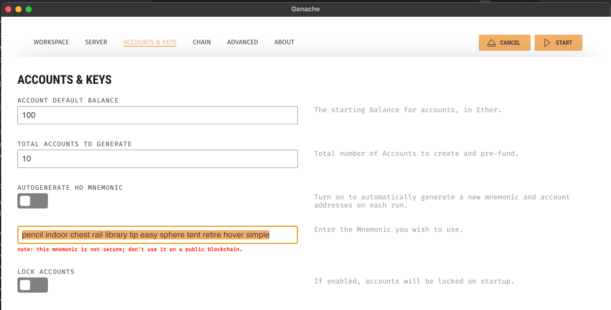
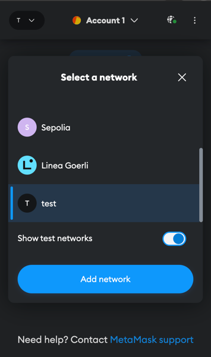
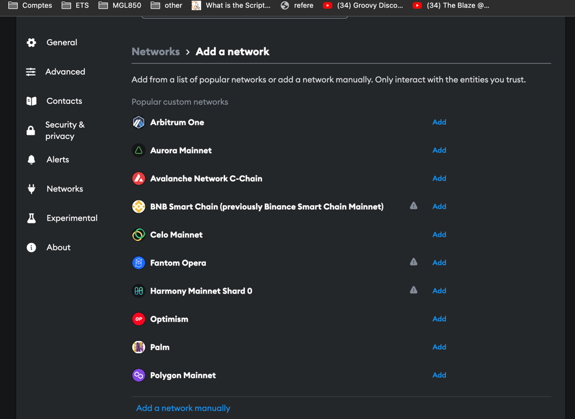
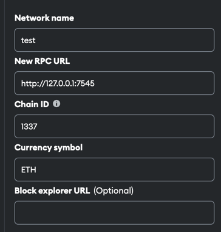
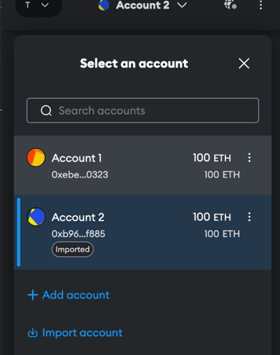
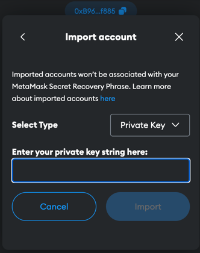
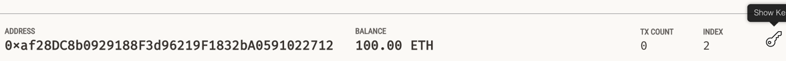

# Demo
https://www.youtube.com/watch?v=jV2Ez_j8w_0&ab_channel=Pier-OlivierBeaulieu 

# React Webapp
- `npm install`

#### Start app 
- Windows-> `npm run start`
- Unix-> `npm run startu`

# Connect Metamask with Ganache
1. Note your seed phrase of your Metamask Wallet somewhere. 
2. Create a new Ganache Workspace and provide your wallet seed phrase

3. Start Ganache Network
4. Add a new network in Metamask extension

5. Add network manually

6. This should connect the first account to your wallet. 
You can then import other accounts by coping the private key without 0x

